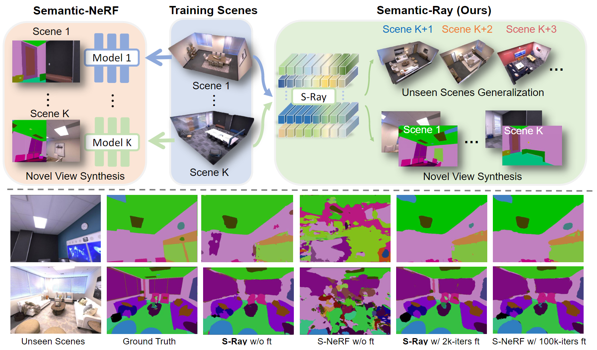

# Semantic Ray: Learning a Generalizable Semantic Field with Cross-Reprojection Attention

Official implementation of [Semantic-Ray: Learning a Generalizable Semantic Field with Cross-Reprojection Attention](https://arxiv.org/pdf/2303.13014.pdf).

The paper has been accepted by **CVPR 2023** 🔥.

## Introduction
We propose a generalizable semantic field named Semantic Ray, which is able to learn from multiple scenes and generalize to unseen scenes. Different from Semantic NeRF which relies on positional encoding thereby limited to the specific single scene, we design a Cross-Reprojection Attention module to fully exploit semantic information from multiple reprojections of the ray. In order to collect dense connections of reprojected rays in an efficient manner, we decompose the problem into consecutive intra-view radial and cross-view sparse attentions, so that we extract informative features at small computational costs. Experiments on both synthetic and real scene data demonstrate the strong generalization ability of our S-Ray. We have also conducted extensive ablation studies to further show the effectiveness of our proposed Cross-Reprojection Attention module. With the generalizable semantic field, we believe that S-Ray will encourage more explorations of potential NeRF-based high-level vision problems in the future.

<div align="center">
  
</div>

## Installation

The code can be tested with Python3.10, PyTorch 2.0 and CUDA 11.7. We recommend you to use [anaconda](https://www.anaconda.com/) to create a new environment and install the dependencies:
```
conda create -n semray python=3.10
conda activate semray
conda install pytorch=2.0 torchvision=0.15 pytorch-cuda=11.7 -c pytorch -c nvidia
pip install -r requirements.txt
```

## Datasets

### ScanNet

Download the ScanNet dataset from [here](http://www.scan-net.org/) and extract the color images, depth images, labels, poses, and intrinsics of each scene. Organize the data in the following structure:
```
├── data
│   ├── scannet
│   │   ├── scene0000_00
│   │   │   ├── color
│   │   │   │   ├── 0.jpg
│   │   │   │   ├── ...
│   │   │   ├── depth
│   │   │   │   ├── 0.png
│   │   │   │   ├── ...
│   │   │   ├── label-filt
│   │   │   │   ├── 0.png
│   │   │   │   ├── ...
│   │   │   ├── pose
│   │   │   │   ├── 0.txt
│   │   │   │   ├── ...
│   │   │   ├── intrinsic
│   │   │   │   ├── extrinsic_color.txt
│   │   │   │   ├── intrinsic_color.txt
│   │   │   │   ├── ...
│   │   │   ├── ...
│   │   ├── ...
│   │   ├── scannetv2-labels.combined.tsv
```
### Replica
Please follow the [Semantic-NeRF](https://github.com/Harry-Zhi/semantic_nerf) for Replica data preparation.
```
├── data
│   ├── Replica
│   │   ├── office_0
│   │   │   ├── Sequence_1
│   │   │   │   ├── depth
│   │   │   │   │   ├── depth_0.png
│   │   │   │   │   ├── ...
│   │   │   │   ├── rgb
│   │   │   │   │   ├── rgb_0.png
│   │   │   │   │   ├── ...
│   │   │   │   ├── semantic_class
│   │   │   │   │   ├── semantic_class_0.png
│   │   │   │   │   ├── ...
│   │   │   │   ├── traj_w_c.txt
│   │   │   ├── Sequence_2
│   │   │   │   ├── depth
│   │   │   │   │   ├── depth_0.png
│   │   │   │   │   ├── ...
│   │   │   │   ├── rgb
│   │   │   │   │   ├── rgb_0.png
│   │   │   │   │   ├── ...
│   │   │   │   ├── semantic_class
│   │   │   │   │   ├── semantic_class_0.png
│   │   │   │   │   ├── ...
│   │   │   │   ├── traj_w_c.txt
```

## Training

(Optional) For better and faster reconstruction results, you can leverage the pretrained model of NeuRay, which can be downloaded from [here](https://github.com/liuyuan-pal/NeuRay). Put the pretrained model in `data/model`. If you want to train from scratch, you can skip this step and comment out the `load_pretrain` option in the config file.

To train Semantic-Ray with ScanNet, run:
```
CUDA_VISIBLE_DEVICES=0 python run_training.py --cfg configs/cra/train_cra_scannet.yaml
```

## Evaluation

To evaluate the trained model, run:
```
CUDA_VISIBLE_DEVICES=0 python run_evaluation.py --cfg configs/cra/test_cra_scannet.yaml --model-path data/model/train_cra_scannet/model_best.pth
```

## Fine-tuning

To fine-tune the trained model on a specific scene, create a new config file following the format of `configs/cra/ft_cra_scannet_scene0376.txt`. Then run:
```
CUDA_VISIBLE_DEVICES=0 python run_training.py --cfg configs/cra/ft_cra_scannet_scene0376.yaml
```

## Acknowledgement
This repo benefits from [NeuRay](https://github.com/liuyuan-pal/NeuRay), [IBRNet](https://github.com/googleinterns/IBRNet), [Semantic-NeRF](https://github.com/Harry-Zhi/semantic_nerf), and [NeRF-pytorch](https://github.com/yenchenlin/nerf-pytorch). Thanks for their wonderful works.

## Citation
If you found this work to be useful in your own research, please consider citing the following:
```
@inproceedings{liu2023semantic,
  author = {Liu, Fangfu and Zhang, Chubin and Zheng, Yu and Duan, Yueqi},
  title = {Semantic Ray: Learning a Generalizable Semantic Field with Cross-Reprojection Attention},
  booktitle = {Proceedings of the IEEE/CVF Conference on Computer Vision and Pattern Recognition},
  year={2023}
}
```

## Contact
If you have any question about this project, please feel free to contact liuff19@mails.tsinghua.edu.cn or zhangcb19@mails.tsinghua.edu.cn.
